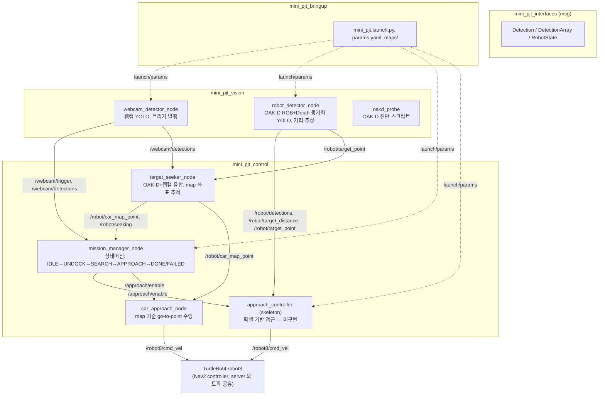
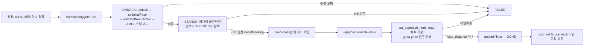

# 🚗 TurtleBot4 웹캠 트리거 + OAK-D 비전 기반 RC카 접근 미니 프로젝트 (mini_pjt_ws)

**팀:** B-4 (Rokey) · **대상 로봇:** TurtleBot4 `robot8` (`ROS_DOMAIN_ID=8`, Discovery Server)

TurtleBot4 실습용 미니 프로젝트로, 고정된 **USB 웹캠**이 RC카를 인식해 트리거를 보내면 도킹 스테이션에 있던 TurtleBot4가 **언도킹 → (Nav2 주행 또는 제자리 탐색) → RC카 근접 접근 → 정지/도킹 복귀**까지 자동으로 수행합니다. 로봇 온보드 **OAK-D Pro** 카메라의 RGB+Depth 동기화 기반 검출로 RC카와의 거리를 측정하고, 웹캠·OAK-D 두 YOLO 검출기를 함께 사용합니다.

일반 산출물과 달리 이 저장소는 **운영/트러블슈팅 문서(`README_nav.md`, `README_vision.md`)를 그 자체로 포함**하고 있으며, 본 문서는 두 문서와 소스 코드를 종합해 프로젝트 전체를 소개하는 대표 README입니다.

---

## 📌 주요 기능 (Key Features)

### 1. 웹캠 트리거 → 자동 미션 상태머신
- `webcam_detector_node`가 고정 웹캠 영상에서 YOLO로 `car` 클래스를 연속 `trigger_frames`(기본 5프레임) 검출하면 `/webcam/trigger`(Bool, transient_local)를 1회 발행합니다.
- `mission_manager_node`가 이를 받아 상태머신을 진행합니다: **IDLE → UNDOCK → SEARCH → APPROACH → DONE / FAILED**
  - `UNDOCK`: 도킹 상태 확인 후 undock → `setInitialPose` → `waitUntilNav2Active` → AMCL 수렴 대기
  - `SEARCH`: 언도킹 직후 임시 목표 주행 없이 **제자리에서 회전하며** 온보드 YOLO로 Car를 탐색 (`search_timeout_sec` 초과 시 `FAILED`)
  - `APPROACH`: Car 발견(`/robot/seeking`) 시 `cancelTask()`로 Nav2를 확실히 끊은 뒤 `/approach/enable=True`로 근접 접근 노드에 제어권을 넘김
  - `DONE`: 목표 도달(`/approach/status`의 `arrived=True`) 시 `cmd_vel` 0 발행, `use_dock=true`면 도킹 복귀
- `dry_run:=true` 파라미터로 실제 로봇 없이 상태머신 로직만 토픽으로 검증할 수 있습니다.
- ⚠️ 코드에는 예전 방식인 `NAV`(사전 지정 `goal_pose`로 주행) 상태도 남아 있지만, 현재는 **미사용**으로 주석 처리되어 있고 `SEARCH`(제자리 탐색) 방식으로 대체되었습니다.

### 2. OAK-D RGB-Depth 동기화 + 거리 추정
- `robot_detector_node`가 OAK-D의 RGB(preview)와 Depth(stereo) 스트림을 `message_filters` 근사 시간 동기화(`sync_slop_sec`)로 짝지어 YOLO 추론을 수행합니다.
- RGB bbox 중심 픽셀을 카메라 내부 파라미터(K)를 이용해 Depth 좌표계로 재투영(`projection_mode: intrinsic`, fallback `scale`)한 뒤, 중심 패치(7×7→11×11→15×15)의 median으로 거리를 산출합니다.
- Depth encoding(`16UC1`/`mono16`=mm, `32FC1`=m)을 런타임에 자동 판별하고, 저역통과 필터(`lpf_alpha`)와 유효 픽셀 부족 시 hold/NaN 처리로 노이즈를 억제합니다.
- `oakd_probe` 진단 스크립트로 실측 RGB/Depth 주기, `camera_info` 비교, 권장 `slop` 값을 사전에 산출할 수 있습니다.

### 3. 2단계 근접 접근(Approach) 파이프라인
프로젝트에는 목적이 같은 두 가지 접근 제어 구현이 공존합니다.

| 구분 | 노드 | 방식 | 상태 |
| --- | --- | --- | --- |
| 기본(런치 등록) | `approach_controller` | 픽셀 오차(bbox 중심) + depth 거리로 직접 `cmd_vel` 제어 | ⚠️ **스켈레톤 — `control_loop`가 `pass`로 미구현** |
| 대체 구현 | `target_seeker_node` + `car_approach_node` | OAK-D 3D 좌표를 TF로 map 프레임에 투영해 목표점 기억(`/robot/car_map_point`) 후 map 기준 go-to-point 주행, `Dummy` 장애물 근사 회피 포함 | ✅ 완전히 구현됨 (런치 파일에는 기본 포함 안 됨, 수동 실행 필요) |

즉, `mini_pjt.launch.py`를 그대로 실행하면 `APPROACH` 상태에서 실제로는 아무 동작도 하지 않으므로, **RC카 접근이 실제로 동작하려면 `target_seeker_node` + `car_approach_node`를 별도로 함께 실행**해야 합니다. (자세한 내용은 아래 [알려진 이슈](#-알려진-이슈--todo) 참고)

### 4. cmd_vel 경합 방지
- 이 로봇 스택에는 `twist_mux`가 없어 Nav2 `controller_server`와 접근 제어 노드가 같은 `/robot8/cmd_vel` 토픽을 공유합니다.
- `mission_manager_node`는 `APPROACH` 진입 전 반드시 `navigator.cancelTask()` → `isTaskComplete()` 폴링 → 잔여 명령 제거(zero Twist 2회 발행)까지 확인한 뒤에만 `/approach/enable=True`를 올려, Nav2와 수동 제어가 동시에 `cmd_vel`을 쏘는 상황을 방지합니다.

### 5. SLAM 맵 작성 및 좌표 취득 도구
- `turtlebot4_navigation`의 `slam.launch.py` + 텔레옵으로 맵을 만들고 `map_saver_cli`로 저장(`basic_map.pgm`/`.yaml`)합니다.
- RViz2의 `2D Pose Estimate`/`2D Goal Pose`/`Publish Point`로 찍은 좌표를 `/robot8/amcl_pose`, `/robot8/goal_pose`, `/robot8/clicked_point`로 echo해 `params.yaml`에 반영하며, 쿼터니언→yaw(도) 변환이 필요합니다(`pose_tool.py` 및 README_nav.md 3절 참고).

### 6. 환경 점검 스크립트
- `check_env.sh <namespace>`가 ROS 환경변수(`ROS_DOMAIN_ID`, `RMW_IMPLEMENTATION`, `ROS_SUPER_CLIENT` 등), 로봇 필수 토픽·OAK-D 토픽 존재, 노드 목록, 로봇↔PC 양방향 통신(데이터 수신 Hz까지), 로컬 파이썬 의존성(ultralytics/torch/CUDA/cv_bridge), 커스텀 메시지 빌드 여부, 웹캠 장치까지 한 번에 점검하고 OK/WARN/FAIL로 요약합니다.

---

## 🛠 시스템 설계 (System Architecture)

### 패키지 구조 (4개 ROS2 패키지)



| 패키지 | 역할 |
| --- | --- |
| `mini_pjt_bringup` | 통합 launch(`mini_pjt.launch.py`), 파라미터(`params.yaml`), 지도(`maps/basic_map.*`) |
| `mini_pjt_vision` | 웹캠·OAK-D YOLO 검출 노드, OAK-D 진단 스크립트(`oakd_probe`) |
| `mini_pjt_control` | 미션 상태머신, 근접 접근 제어(2가지 구현) |
| `mini_pjt_interfaces` | 커스텀 메시지 정의 (`Detection`, `DetectionArray`, `RobotState`) |

### 커스텀 메시지

| 메시지 | 필드 | 용도 |
| --- | --- | --- |
| `Detection` | `class_name`, `confidence`, `center_x/y`, `bbox[4]` | 단일 객체 검출 결과 (웹캠/온보드 공용) |
| `DetectionArray` | `header`, `Detection[] detections` | 한 프레임의 검출 묶음 |
| `RobotState` | `header`, `state`, `target_distance`, `arrived` | 미션/접근 노드가 발행하는 로봇 상태 (`INIT`~`FAILED` 등) |

### 주요 ROS2 Topic

| 발행 노드 | 토픽 | 타입 | 설명 |
| --- | --- | --- | --- |
| `webcam_detector_node` | `/webcam/detections`, `/webcam/trigger`, `/webcam/annotated`(+`/compressed`) | `DetectionArray`, `Bool`, `Image` | 웹캠 검출·트리거 |
| `robot_detector_node` | `/robot/detections`, `/robot/target_distance`, `/robot/annotated`(+`/compressed`), `/robot/target_point` | `DetectionArray`, `Float32`, `Image`, `PointStamped` | OAK-D 검출·거리·3D 위치 |
| `mission_manager_node` | `/robot/state`, `/approach/enable`, `/robot/seeking` | `RobotState`, `Bool`, `Bool` | 미션 상태, 접근 활성화 |
| `target_seeker_node` | `/robot/car_map_point`, `/robot/car_marker`, `/robot/seeking` | `PointStamped`, `Marker`, `Bool` | Car의 map 좌표, RViz 시각화 |
| `car_approach_node` / `approach_controller` | `/robot8/cmd_vel`, `/approach/status` | `Twist`, `RobotState` | 접근 주행 명령, 도달 상태 |

### 공정 흐름 (Process Flow)



### AMCL 수렴 판정 기준
`/robot8/amcl_pose` 공분산(6×6 row-major) 기준으로 `cov[0]`(x분산) ≤ 0.05m², `cov[7]`(y분산) ≤ 0.05m², `cov[35]`(yaw분산) ≤ 0.06rad²을 **연속 3회**(`amcl_required_hits`) 만족해야 수렴으로 인정합니다.

---

## 🖥 개발 환경 (Environment)

| 항목 | 내용 |
| --- | --- |
| OS | Ubuntu 22.04 LTS (Jammy Jellyfish) |
| Middleware | ROS 2 Humble, Discovery Server 모드 (`ROS_DOMAIN_ID=8`, `RMW_IMPLEMENTATION=rmw_fastrtps_cpp`) |
| Language | Python 3.10 |
| Vision | Ultralytics YOLO(v11n 커스텀 학습 모델), PyTorch(CUDA), OpenCV, `cv_bridge`, `message_filters` |
| Navigation | Nav2 (`turtlebot4_navigation`: `slam.launch.py`, `localization.launch.py`, `nav2.launch.py`), `nav2_simple_commander` |
| Key ROS Deps | `rclpy`, `sensor_msgs`, `geometry_msgs`, `nav2_msgs`, `irobot_create_msgs`, `tf2_ros`, `tf2_geometry_msgs`, `visualization_msgs` |
| Build | `ament_python` (3개 패키지) / `ament_cmake` + `rosidl` (`mini_pjt_interfaces`) |

---

## ⚙️ 사용 장비 (Hardware Setup)

| 구성 요소 | 비고 |
| --- | --- |
| TurtleBot4 (Create® 3 Base) | 네임스페이스 `robot8`, Discovery Server로 원격 PC와 연결 |
| OAK-D Pro (온보드) | RGB(preview, 기본 10fps)·Depth(stereo) 스트림, RC카까지의 3D 위치·거리 추정 |
| USB 웹캠 (고정형) | `/dev/v4l/by-id/...` 이름 기반 심볼릭 링크로 지정 (인덱스 번호는 재연결마다 바뀜) |
| RC카 (목표 객체, `car`/`Car` 클래스) | 접근·정지 대상 |
| 장애물 모형 ("Dummy" 클래스) | `car_approach_node`의 근사 회피 로직 테스트용 |
| TurtleBot4 도킹 스테이션 | 언도킹/도킹 복귀 지점 |

---

## 📦 의존성 설치 (Installation)

### 1. ROS2 / TurtleBot4 환경
```bash
sudo apt update
sudo apt install ros-humble-desktop ros-humble-navigation2 ros-humble-nav2-bringup \
                  ros-humble-turtlebot4-navigation ros-humble-turtlebot4-viz \
                  ros-humble-cv-bridge ros-humble-message-filters \
                  python3-colcon-common-extensions
```
로봇/PC 양쪽에 `/etc/turtlebot4_discovery/setup.bash` (Discovery Server 설정)가 구성되어 있어야 합니다.

### 2. Python 비전 의존성
```bash
pip install ultralytics opencv-python numpy torch
```
`check_env.sh`의 7절에서 `ultralytics`, `torch`, `cv2`, `cv_bridge`, `message_filters`, CUDA 사용 가능 여부를 한 번에 점검할 수 있습니다.

### 3. 워크스페이스 빌드
```bash
cd ~/mini_pjt_ws
colcon build --symlink-install
source install/setup.bash
```
`mini_pjt_interfaces`(커스텀 메시지)를 포함해 4개 패키지가 모두 빌드되어야 하며, 빌드 후 `python3 -c "import mini_pjt_interfaces.msg"`로 확인할 수 있습니다.

### 4. YOLO 모델 가중치
`params.yaml`의 `model_path`(웹캠: `best_v11n.pt`, OAK-D: `best.pt`, 클래스 `{0:'Car', 1:'Dummy'}`)를 실제 학습된 가중치 경로로 맞춰야 합니다. 저장소에는 가중치 파일이 포함되어 있지 않습니다.

---

## 🚀 실행 순서 (How to Run)

모든 터미널에서 공통으로 아래 순서로 source 합니다 (뒤에 source한 것이 앞을 덮어씀에 주의):

```bash
source /opt/ros/humble/setup.bash && \
source ~/turtlebot4_ws/install/setup.bash && \
source /etc/turtlebot4_discovery/setup.bash && \
source ~/mini_pjt_ws/install/setup.bash
```

### 0. 환경 점검
```bash
cd ~/mini_pjt_ws && ./check_env.sh robot8
```

### 1. (최초 1회 또는 환경 변경 시) SLAM 맵 작성
```bash
ros2 launch turtlebot4_navigation slam.launch.py namespace:=/robot8      # 터미널 A
ros2 launch turtlebot4_viz view_robot.launch.py namespace:=/robot8       # 터미널 B
ros2 run teleop_twist_keyboard teleop_twist_keyboard --ros-args -r __ns:=/robot8  # 터미널 C
# 맵이 채워지면 저장
ros2 run nav2_map_server map_saver_cli -f ~/mini_pjt_ws/src/mini_pjt_bringup/maps/basic_map --ros-args -r __ns:=/robot8
cd ~/mini_pjt_ws && colcon build --packages-select mini_pjt_bringup --symlink-install
```
기존 `basic_map`이 있으므로 평소에는 생략합니다.

### 2. Localization + Nav2 기동 (미션 실행 전 필수)
```bash
ros2 launch turtlebot4_navigation localization.launch.py namespace:=/robot8 map:=$HOME/mini_pjt_ws/src/mini_pjt_bringup/maps/basic_map.yaml   # 터미널 A
ros2 launch turtlebot4_navigation nav2.launch.py namespace:=/robot8                                                                              # 터미널 B
ros2 launch turtlebot4_viz view_robot.launch.py namespace:=/robot8                                                                               # 터미널 C
```
`mission_manager_node`는 Nav2를 직접 띄우지 않고 이미 떠 있는 Nav2에만 요청을 보냅니다.

### 3. (선택, 최초 설정 시) OAK-D 동기화 진단
```bash
ros2 run mini_pjt_vision oakd_probe --ns /robot8 --samples 100
```
출력된 권장 `slop` 값을 `params.yaml`의 `sync_slop_sec`에 반영합니다.

### 4. 통합 노드 실행
```bash
cd ~/mini_pjt_ws
ros2 launch mini_pjt_bringup mini_pjt.launch.py dry_run:=false
```
| 인자 | 기본값 | 설명 |
| --- | --- | --- |
| `params_file` | `config/params.yaml` | 통합 파라미터 |
| `dry_run` | `true` | `true`면 Nav2/도킹 호출 없이 상태머신만 동작 |
| `enable_webcam` | `true` | 웹캠 검출 노드 실행 여부 |
| `enable_onboard` | `true` | OAK-D 온보드 검출 노드 실행 여부(로봇 필요) |

이 launch는 `webcam_detector_node`, `robot_detector_node`, `mission_manager_node`, `approach_controller`(⚠️ 스켈레톤)를 띄웁니다.

### 5. RC카 접근을 실제로 동작시키려면 (별도 실행 필요)
```bash
ros2 run mini_pjt_control target_seeker_node --ros-args --params-file install/mini_pjt_bringup/share/mini_pjt_bringup/config/params.yaml
ros2 run mini_pjt_control car_approach_node  --ros-args --params-file install/mini_pjt_bringup/share/mini_pjt_bringup/config/params.yaml
```

### 6. 동작 확인
```bash
ros2 topic echo /robot/state
ros2 run rqt_image_view rqt_image_view /robot/annotated      # 또는 /webcam/annotated
```

### 7. dry_run 시뮬레이션 (로봇 없이 상태머신만 검증)
```bash
ros2 run mini_pjt_control mission_manager_node --ros-args --params-file install/mini_pjt_bringup/share/mini_pjt_bringup/config/params.yaml
ros2 topic pub --once /webcam/trigger std_msgs/msg/Bool "{data: true}" --qos-durability transient_local --qos-reliability reliable
ros2 topic pub --once /approach/status mini_pjt_interfaces/msg/RobotState "{state: APPROACHING, target_distance: 0.28, arrived: true}"
```

### 실기 실행 전 체크리스트
- [ ] `initial_pose`가 실측 언도킹 위치로 채워져 있는가
- [ ] localization + nav2가 떠 있는가 (`/robot8/amcl_pose` 확인)
- [ ] 로봇이 도킹 스테이션 위에 있는가 (`ros2 topic echo /robot8/dock_status --once`)
- [ ] 트리거가 들어오면 즉시 언도킹·주행하므로 로봇 주변에 사람이 없는가

---

## ⚠️ 알려진 이슈 / TODO

- **`approach_controller` 미구현**: `mini_pjt.launch.py`에 기본 등록된 픽셀 기반 접근 노드(`mini_pjt_control/approach_controller.py`)는 `control_loop`/`detections_callback`이 `pass`로만 되어 있는 스켈레톤입니다. 실제 RC카 접근·정지·`arrived` 발행은 **`target_seeker_node` + `car_approach_node`**(map/TF 기반, 완전 구현)로 이루어지므로 반드시 함께 실행해야 하며, 향후 launch 파일에 두 노드를 정식 반영하는 정리가 필요합니다.
- **`NAV` 상태 미사용**: `mission_manager_node`의 상태 Enum에 `NAV`(사전 지정 `goal_pose` 주행)가 남아 있으나 현재 흐름은 `SEARCH`(제자리 탐색)로 대체되어 `NAV`는 호출되지 않습니다. `params.yaml`의 `goal_pose` 값도 현재 미사용입니다.
- **cmd_vel 경합**: `twist_mux`가 없어 Nav2와 접근 제어가 시간적으로 분리된 것에 의존합니다(`cancelTask()` 확인 절차로 대응). 여러 제어원이 동시에 필요해지면 `README_nav.md` 4-4절의 `twist_mux` 도입안을 참고하세요.
- **`pose_tool.py`, `mini_pjt_system_design.drawio`**: 좌표 취득 보조 스크립트와 시스템 설계 다이어그램(draw.io)이 저장소 루트에 포함되어 있습니다.

---

## 🧭 트러블슈팅 요약

자세한 원인·조치는 `README_nav.md`(Nav2/맵/좌표/cmd_vel 경합), `README_vision.md`(OAK-D 동기화/좌표 정합/검증 절차)를 참고하세요. 대표 증상만 요약합니다.

| 증상 | 원인 / 조치 |
| --- | --- |
| `ros2 topic list`에 로봇 토픽이 안 보임 | 비대화형 셸이면 `ROS_SUPER_CLIENT=False`. 실제 터미널에서 실행하거나 `export ROS_SUPER_CLIENT=True` |
| 토픽은 보이는데 데이터가 안 옴 | QoS 불일치 (`ros2 topic info <토픽> -v`). BEST_EFFORT 발행 + RELIABLE 구독은 절대 연결되지 않음 |
| OAK-D 토픽이 전혀 없음 | `ros2 node info /robot8/oakd`로 퍼블리셔 확인 → 없으면 `sudo systemctl restart turtlebot4.service`, 있는데 스트림만 없으면 `i_enable_lazy_publisher false` 설정 |
| 회전 시 RC카 거리값이 튐 | 좌표 정합(`projection_mode`) 또는 동기화 `slop` 문제. README_vision.md 5·6절 검증 절차 참고 |
| 주행 중 로봇이 떨림 | Nav2와 수동 `cmd_vel` 동시 발행. `ros2 topic info /robot8/cmd_vel -v`로 Publisher count 확인 |

---

## 📁 폴더 구조

```
mini_pjt_ws/
├─ README_nav.md              # Nav2 / 맵 / 좌표 / cmd_vel 경합 운영 문서
├─ README_vision.md           # OAK-D 동기화 / 좌표 정합 / 검증 절차 문서
├─ check_env.sh                # ROS 환경·토픽·의존성 통합 점검 스크립트
├─ pose_tool.py                 # 좌표 취득 보조 스크립트
├─ mini_pjt_system_design.drawio
├─ maps/                        # basic_map / auto_map (pgm + yaml)
├─ test_data/                   # 웹캠 테스트용 mp4
└─ src/
   ├─ mini_pjt_bringup/         # launch, 통합 params.yaml, maps
   ├─ mini_pjt_control/         # mission_manager_node, approach_controller(skeleton),
   │                              target_seeker_node, car_approach_node
   ├─ mini_pjt_interfaces/      # Detection, DetectionArray, RobotState (msg)
   └─ mini_pjt_vision/          # webcam_detector_node, robot_detector_node, oakd_probe
```
